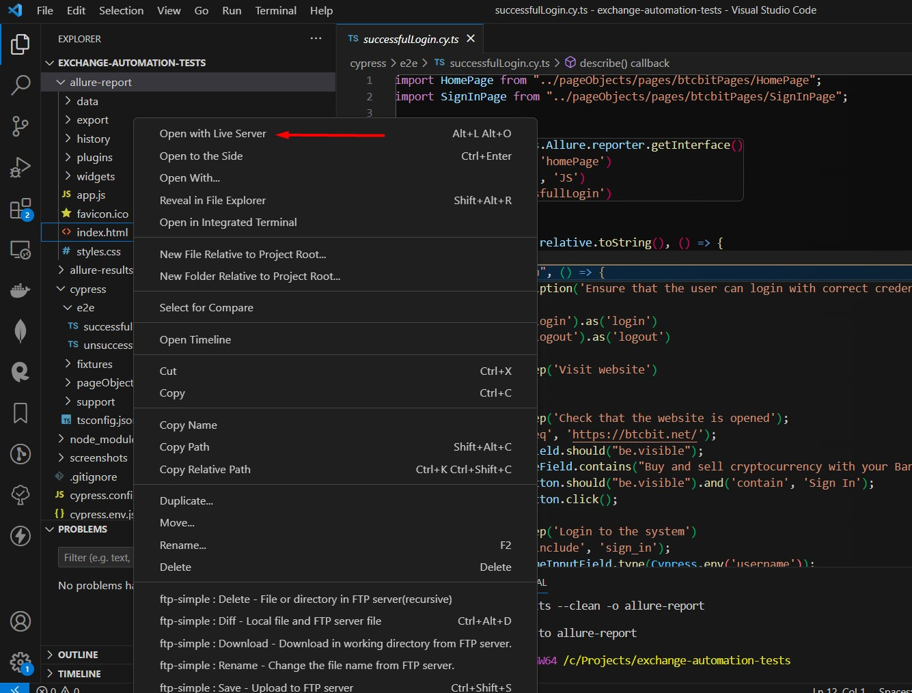
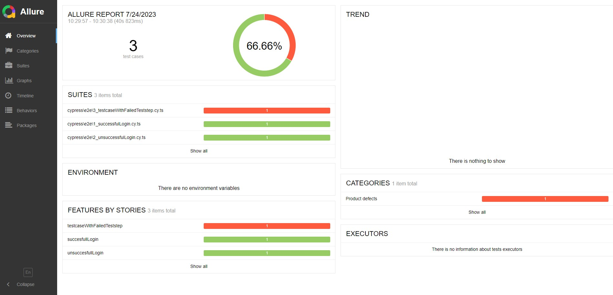
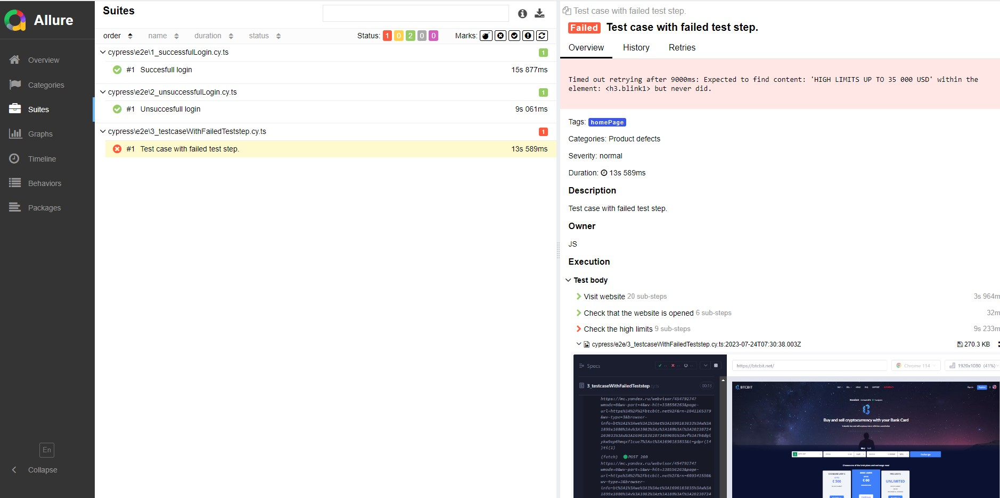

# Cypress Test Project

This is an end-to-end testing setup for Cypress with TypeScript.

## Installation

1. Make sure you have Node.js installed on your machine (When these test were written I had v16.13.0).

2. I use `Visual Studio Code` as a code editor.

3. Clone the repo
   ```bash
   git clone https://github.com/jans888/exchange-automation-tests.git
   ```

4. Install the dependencies:
   ```bash
   cd exchange-automation-tests
   npm install
   ```

## Usage

1. You can open the Cypress Test Runner and then select the test for execution:

```bash
npm run cy:open
```

2. Run tests in headless mode with Allure report generation:

Clear report folder
```bash
npm run clear
```

Run tests in the headless mode
```bash
npm run cypress:headless
```

Generate report
```bash
npm run report
```

3. The report is generated in the `/allure-report`. To open the report right click on `/allure-report/index.html` and select `Open with Live Server`





